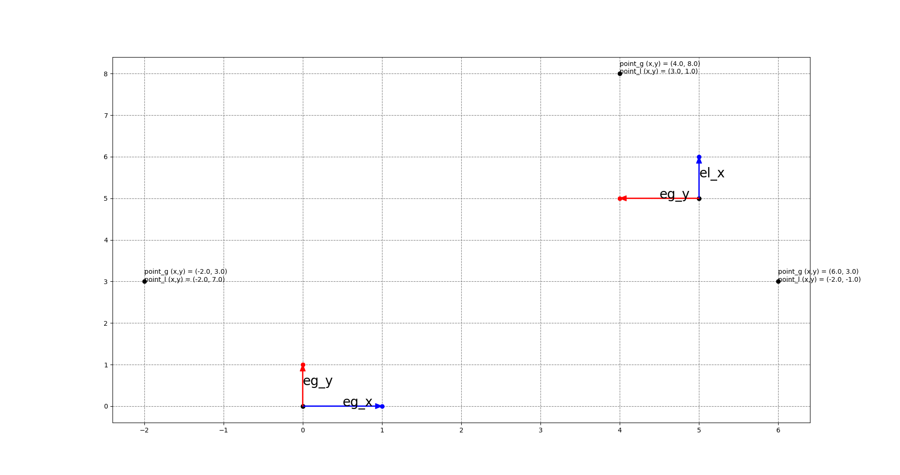

# python_transformAxis

There are a few points in global axis. Calc local positions of these points in local axis.

# DEMO



# Usage

```bash
python python_transformAxis.py
```
# Ref

* [座標系をあわせる　絶対座標とローカル座標](https://programming-surgeon.com/script/coordinate-system/)

# Requirement

* Python 3.9

# Author

* M.Kobayashi